# DTCMR-Reg

This is the public repository for MICCAI 2024 paper:

Groupwise Deformable Registration of Diffusion Tensor Cardiovascular Magnetic Resonance: Disentangling Diffusion Contrast, Respiratory and Cardiac Motions

This directory shows the example code and some supplementary files for DT-CMR registration

Diffusion tensor-based cardiovascular magnetic resonance (DT-CMR) is a novel modality that can probe the microstructure of cardiomyocytes non-invasively.

# Structure of the left ventricle
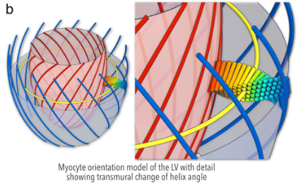 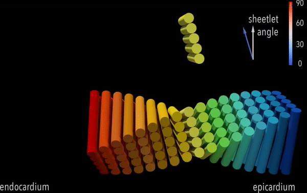

The helixal structure of the cardiomyocytes from enpicardium to endocardium. It compresses and extracts as the heart beats.

    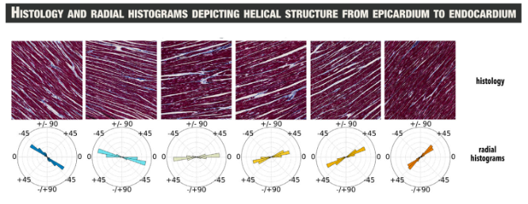

The histology also reveals this. Please refer to: 
- Nielles-Vallespin, Sonia; Scott, Andrew; Ferreira, Pedro; Khalique, Zohya; Pennell, Dudley; Firmin, David. "Cardiac diffusion: technique and practical applications." *Journal of Magnetic Resonance Imaging* 52.2 (2020): 348-368. Wiley Online Library.

# Methods

    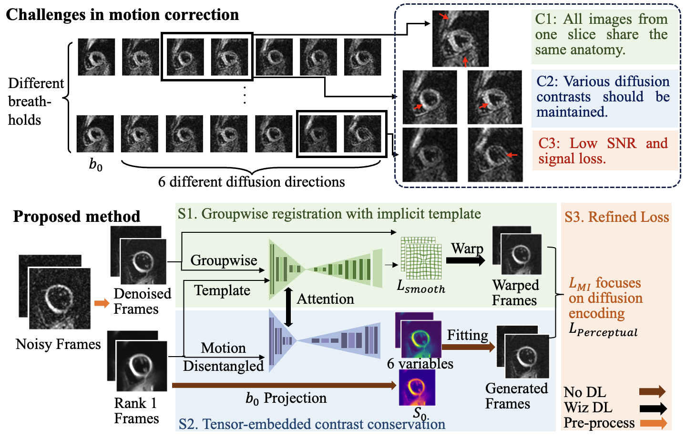

## Model-based Generation

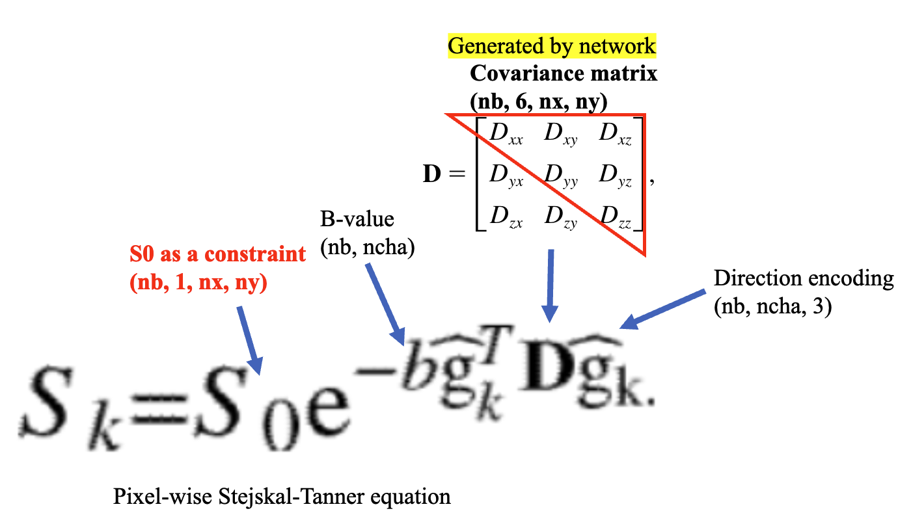
We can use Stejskal-Tanner equation to generate the diffusion images with the same anatomy. Since the diffusion covariance matrix is symmetric, only variables in the upper-left triangles are independent, corresponding to the variables of the generation branch.

## The generation of DT-CMR from the tensors

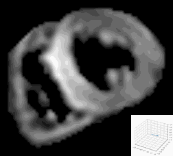 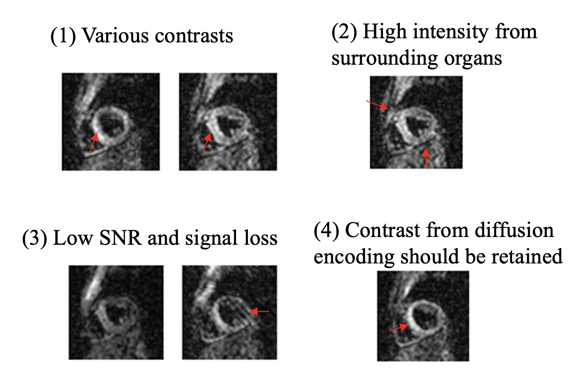

Theoretically, once the S0 and 6 variables are derived, diffusion images from all the b-values can be generated (left). We are still facing the problem of: 
- Noise
- Motion during the long acquisition

# Low-rank extraction and implicit template

    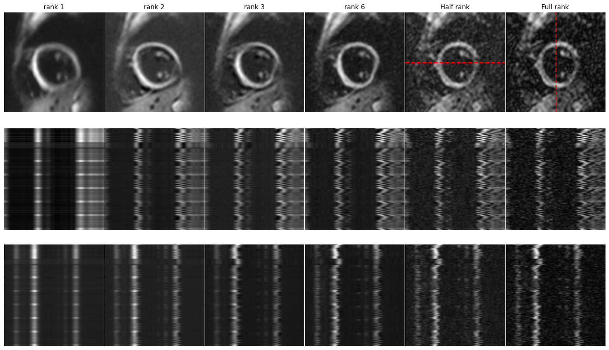

We explored the feasibility of the template. Although different frames may have local deformations, the rank-1 projection of them are aligned. In-plane shifts, local deformation, diffusion encoding information and noise gradually appear as rank gradually increases.

# Can S0 be generated instead of projection?

    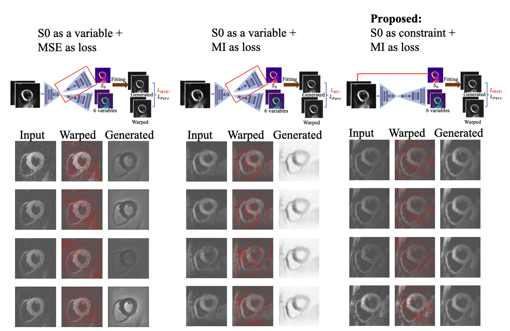

Besides the ablation study, we also did experiments on whether they can be no contrain in the generation branch. Results show that solely using the Mean squared error or mutual information to supervise can lead fraud in the generation branch. 

# Results

    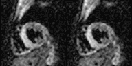

The left is the image before motion correction, right is the one after motion correction.

## Additional Case
We also show a challenging case with large motion and noise.

    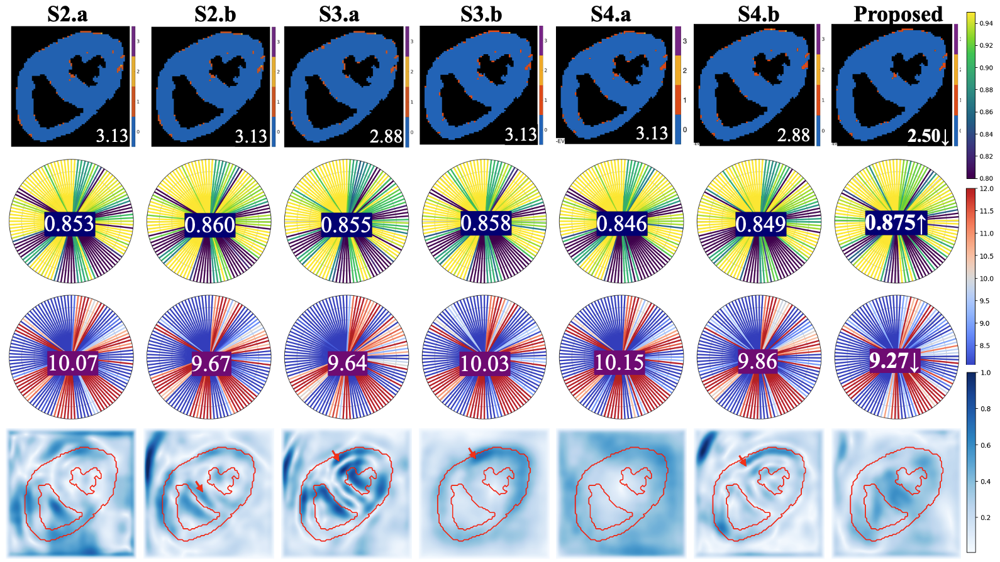

Ablation studies on a challenging case. Different modules showing different solutions are evaluated.

    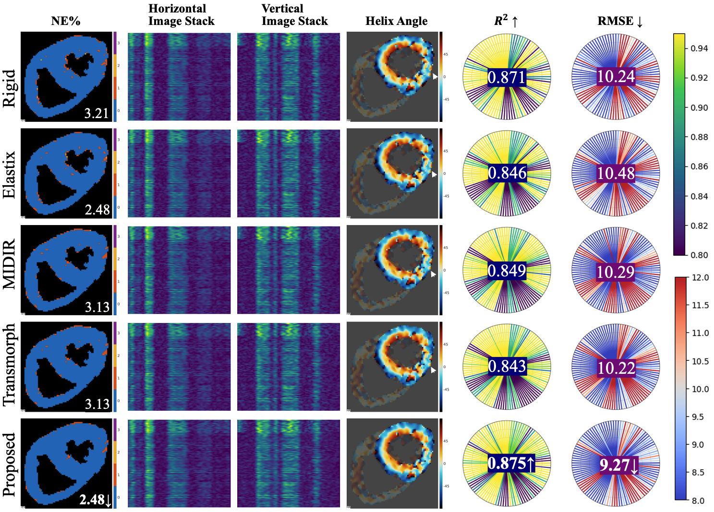

Comparison studies on a challenging case. Rigid, deformable registration in Elastix and two deep learning methods are applied. The proposed method outperforms the others based on the NE\%, R2 and RMSE of the HAG. 

